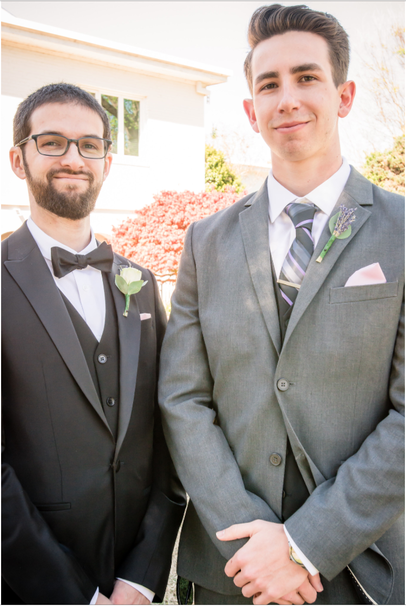

# John A. Rollinson
- 1638 Edilee Drive, Cardiff CA. 92007
- (760)-809-4178

## Contact Info:  [Email](rollinsonjohn1@gmail.com)  [LinkedIn](https://www.linkedin.com/in/john-a-rollinson)
## Education

- **MiraCosta College**
A.S. Computer Science - Summer 2015 - Fall 2018

- **La Costa Canyon Highschool**
Highschool Deploma, General Education - Graduated Spring 2015

## Course Objective: 
- To be able to qualify for a position related to my field of specialization, which will serve not only as a career growth but as a challenge to my profession.

## Technical Skills
- **Languages:** 
Java, C++, C#, Swift, HTML, CSS.
- **Operating Systems:**
Windows (98 - 10), Linux (CentOS & Ubuntu), Mac OS X (Snow Leopard - High Sierra)
- **Applications:**
Microsoft Office, Adobe Photoshop, Microsoft Visual Studio, Eclipse, Sony Vegas, Unity

## Courses Taken
- AP Computer Science (Highschool)
- Webdesign (Highschool)
- CS111 (MiraCosta)
- CS112 (MiraCosta)
- CS113 (MiraCosta)
- CS150 (MiraCosta)
- CS151 (MiraCosta)
- CS220 (MiraCosta)
- CSIT165 (MiraCosta)

## Work Experience
### Computer Repair Center (Oct. 2016 - Present)
-Independent Contractor | 20 hours per week | Encinitas/Oceanside, CA
- Computer/Electronic hardware repair/replacement.
- Software repair/instalation.
- Virus and Malware Removal.
- Data Recovery/Transfer.
- Complete system builds and system maintenance. 
- Accross all different platforms: mobile, desktop, laptop, tablet, server racks, etc.

### Freelance (Oct. 2016 - Present)
-IT Consultant | N/A | Encinitas, CA
- Computer/Electronic hardware repair/replacement.
- Software repair/instalation.
- Virus and Malware Removal.
- Data Recovery/Transfer.
- Complete system builds and system maintenance. 
- Accross all different platforms: mobile, desktop, laptop, tablet, server racks, etc.

### Laptops and Beyond (Oct. 2016 - Aug. 2017)
-Independent Contractor | 20 hours per week | Encinitas, CA
- Computer/Electronic hardware repair/replacement.
- Software repair/instalation.
- Virus and Malware Removal.
- Data Recovery/Transfer.
- Complete system builds and system maintenance. 
- Accross all different platforms: mobile, desktop, laptop, tablet, server racks, etc.

### Dairy Queen (Jan. 2016 - Oct. 2016)
-Manager | 25 hours per week | Encinitas, CA
- Maintained inventory and balanced the books for the franchise.
- Stocked goods, made bank runs, and answered phone calls.
- Assisted customers and provided excellent customer service.

## Related to Computer Science
- While attending MiraCosta, worked as a Computer Science tutor at the S.T.E.M. Center.
- Computer Science Club member
- Information Technology Club member
